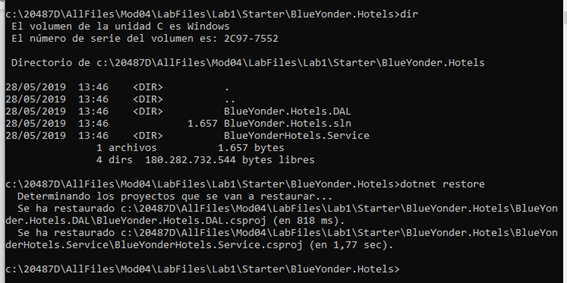
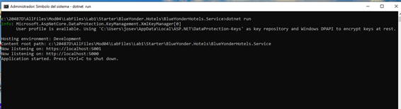
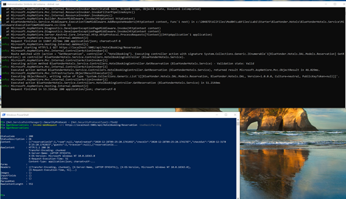
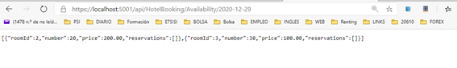
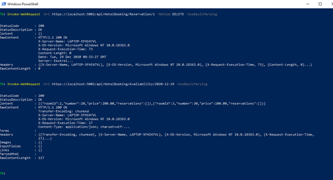
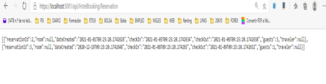
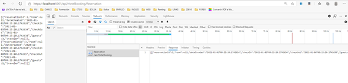

**20487D_MOD04_LAK**

 

**# Module 4: Extending ASP.NET Core HTTP Services**

 

\# Lab: Customizing the ASP.NET Core Pipeline

 

 

Levantamos el servicio:

 

Vemos http content:

 

 

Como en la última práctica, no me funciona el comando Invoke para consultar la disponibilidad:

 

No obstante, el servicio funciona como se puede comprobar en el navegador:

Para borrar una reserva, sí funciona el comando invoke:

 

Repetimos el comando para verificar que la lista de habitaciones no ha cambiado.

 

 

**Exercise 3: Create a Debugging Middleware**

**Task 5: Test the new middleware from a browser**

 

****

 

****