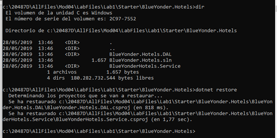
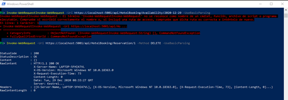

# 20487D_MOD04_LAK_BlueYonderHotels

JOSE VICENTE TEJERO - 29/12/2020

RESUMEN

# Module 4: Extending ASP.NET Core HTTP Services
# Lab: Customizing the ASP.NET Core Pipeline

Use Dependency Injection to Get a Repository Object
Implement the interface on the repository
Register the repository object in the ASP.NET Core Dependency Injection mechanism
Change the controller’s constructor to request an injected repository

Create a Cache Filter
Create an action filter for cache headers
Add the cache filter to several actions
Test cacheable and non-cacheable actions from a browser

Create a Debugging Middleware
Write server and debug information to response headers
Create the IApplicationBuilder helper class
Register the middleware to the ASP.NET Core pipeline
Test the new middleware from a browser

PROBLEMAS
No
**20487D_MOD04_LAK**

 

**# Module 4: Extending ASP.NET Core HTTP Services**

 

\# Lab: Customizing the ASP.NET Core Pipeline

 

 

Levantamos el servicio:

 

Vemos http content:

 

 

Como en la última práctica, no me funciona el comando Invoke para consultar la disponibilidad:

 

No obstante, el servicio funciona como se puede comprobar en el navegador:

Para borrar una reserva, sí funciona el comando invoke:

 

Repetimos el comando para verificar que la lista de habitaciones no ha cambiado.

 

 

**Exercise 3: Create a Debugging Middleware**

**Task 5: Test the new middleware from a browser**

 

****

 

****
